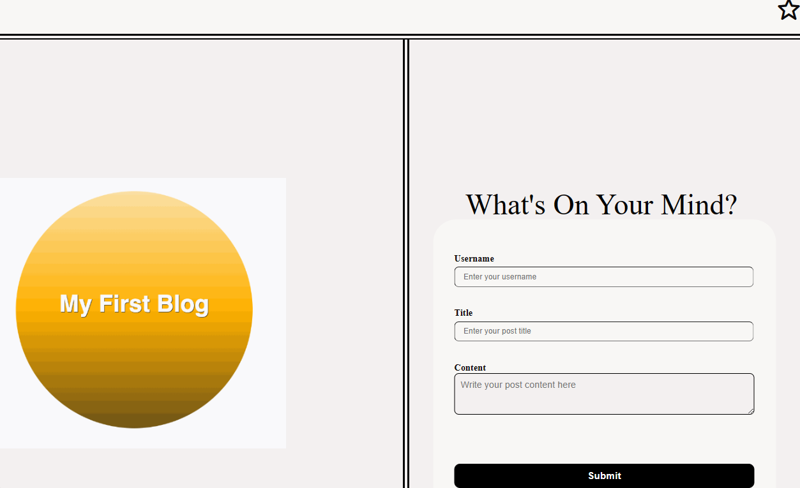

# Challenge 4: My Personal Blog Site | Eloy Garza

## Description

Personal blog site for Eloy Garza to enter and view blog posts.

## Usage

The link to my deployed github portfolio is: https://egarza0614.github.io/myBlog_Site

The landing page contains a form with labels and inputs for username, blog title, and blog content.

When you submit the form, the blog post data is stored to localStorage and you are redirected to the posts page.

If you try to submit a form without a username, title, or content, you are I am presented with a message that prompts me to complete the form.

If you view the posts page, you are am presented with a header, with a light mode/dark mode toggle, and a "Back" button.

If you click the light mode/dark mode toggle, the page content's styles update to reflect the selection.

If you click the "Back" button, you are am redirected back to the landing page where you can input more blog entries.

If you view the main content, you are am presented with a list of blog posts that are pulled from localStorage.

If you view localStorage, you are am presented with a JSON array of blog post objects, each including the post author's username, title of the post, and post's content.

If you take a closer look at a single blog entry in the list,
you are can see the title, the content, and the author of the post.

If you view the footer, you are presented with a link to the developer's portfolio.

## Technologies Used
    - HTML
    - CSS
    - JavaScript
    - localStorage API

## Mock-Up

The following image shows the web application's appearance:

## License

[MIT © Eloy Garza](../LICENSE)
